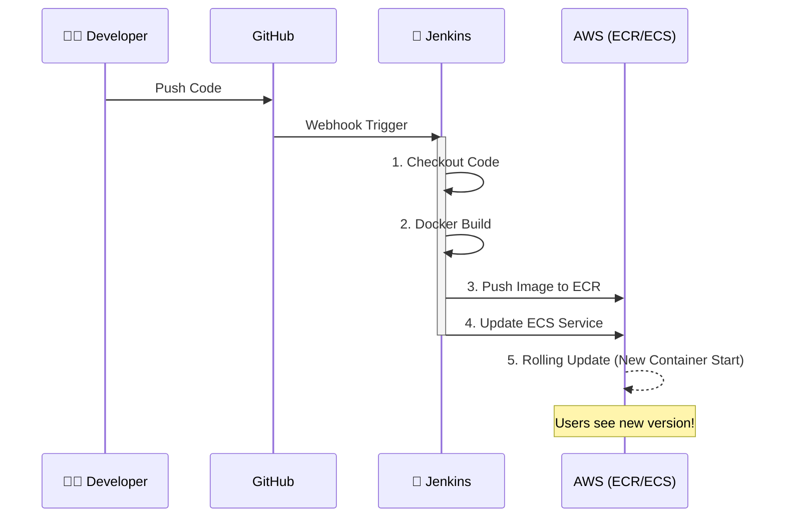

# 🗺️ Architecture & Codebase Overview

이 문서는 Energy Truck 프로젝트의 **전체 아키텍처**와 **코드 구조**를 시각적으로 정리한 문서입니다.
복잡한 문서들을 `docs/archive`로 정리하고, 핵심 내용을 이곳에 요약했습니다.

---

## 🏛 1. AWS 인프라 아키텍처 (Infrastructure)

Terraform으로 구축된 AWS 클라우드 환경의 구조도입니다.

```mermaid
graph TD
    User((User)) -->|HTTPS| ALB[Load Balancer (ALB)]
    
    subgraph VPC [AWS Cloud (ap-northeast-2)]
        ALB -->|/api/*| BackendTG[Backend Target Group]
        ALB -->|/*| FrontendTG[Frontend Target Group]
        
        subgraph ECS [ECS Cluster (Fargate)]
            BackendTG -->|Port 8000| Backend[🐍 Backend Container]
            FrontendTG -->|Port 3000| Frontend[⚛️ Frontend Container]
        end
        
        Backend <-->|Connect| Supabase[(Supabase DB)]
    end
    
    Jenkins[Jenkins CI/CD] -->|1. Build & Push| ECR[AWS ECR Repository]
    Jenkins -->|2. Deploy| ECS
    ECR -.->|Pull Image| ECS
```

### 핵심 구성요소
*   **ALB (Load Balancer)**: 사용자의 요청을 받아 프론트엔드/백엔드로 분배합니다.
*   **ECS Fargate**: 서버를 직접 관리하지 않고 컨테이너만 실행하는 '서버리스' 환경입니다.
*   **ECR**: Docker 이미지를 저장하는 AWS 전용 저장소입니다.
*   **Jenkins**: 코드가 변경되면 자동으로 빌드하고 배포하는 자동화 서버입니다.

---

## 🔄 2. CI/CD 배포 파이프라인 (Flow)

개발자가 코드를 작성하고 배포되기까지의 과정입니다.



---

## 📂 3. 프로젝트 폴더 구조 (Directory Structure)

각 폴더가 어떤 역할을 하는지 한눈에 볼 수 있습니다.

```
/mnt/c/workspace2/aws_pro1
├── 📂 backend               # 🐍 Python FastAPI 백엔드
│   ├── main.py              # 메인 서버 코드
│   ├── Dockerfile           # 백엔드용 Docker 설정
│   └── requirements.txt     # 파이썬 라이브러리 목록
│
├── 📂 energy-trading-app    # ⚛️ Next.js 프론트엔드
│   ├── app/                 # 페이지 및 컴포넌트 코드
│   ├── public/              # 이미지 등 정적 파일
│   └── Dockerfile           # 프론트엔드용 Docker 설정
│
├── 📂 terraform             # 🏗️ 인프라 코드 (IaC)
│   ├── alb.tf               # 로드밸런서 설정
│   ├── ecs.tf               # 서버(컨테이너) 설정
│   ├── vpc.tf               # 네트워크 설정
│   └── terraform.tfstate    # 현재 인프라 상태 저장 파일 (중요!)
│
├── 📂 docs                  # 📚 문서함
│   ├── archive/             # (정리됨) 이전 가이드 문서들
│   ├── aws_jenkins_terraform_setup_complete.md  # ✅ 통합 설정 가이드
│   ├── monitoring_guide.md                      # 📊 모니터링 가이드
│   └── architecture_overview.md                 # 🗺️ (현재 문서)
│
├── 📂 jenkins               # 🤖 젠킨스 설정
│   └── .env                 # (보안) AWS 접속 키 저장
│
├── docker-compose.yml       # 로컬 실행 및 젠킨스 실행용
└── Jenkinsfile              # 젠킨스 파이프라인 스크립트
```

---

## 🚀 4. 주요 접속 정보 (Quick Links)

*   **웹사이트 주소**: [http://energy-truck-alb-2052459691.ap-northeast-2.elb.amazonaws.com](http://energy-truck-alb-2052459691.ap-northeast-2.elb.amazonaws.com)
*   **Jenkins 주소**: [http://localhost:8080](http://localhost:8080) (로컬 실행 시)
*   **AWS Console**: [ap-northeast-2 (Seoul)](https://ap-northeast-2.console.aws.amazon.com/ecs/home?region=ap-northeast-2#/clusters/energy-truck-cluster/services)

---

이 문서는 프로젝트의 전체 그림을 파악하는 용도입니다.
상세한 설정 방법은 `docs/aws_jenkins_terraform_setup_complete.md`를 참고하세요.
