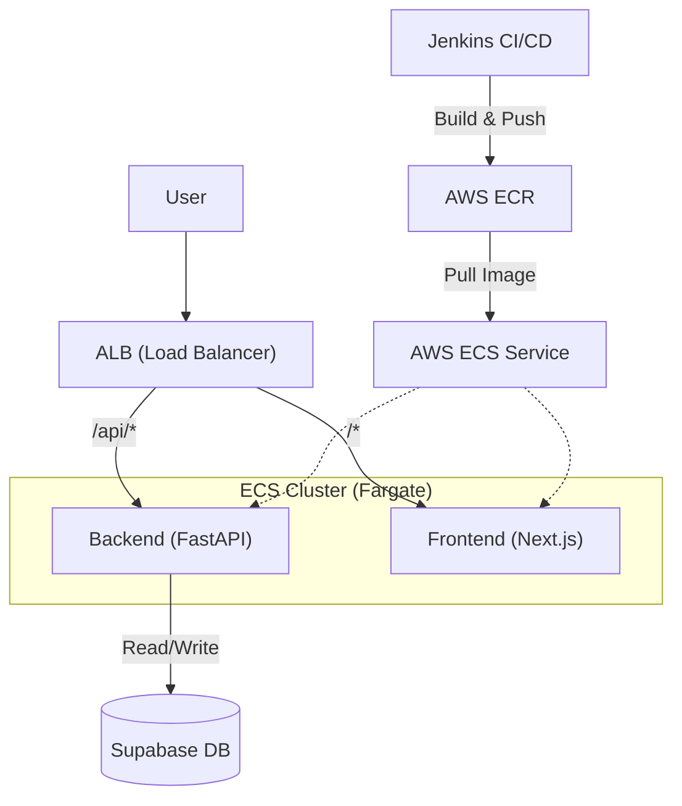

# 프로젝트 코드 및 아키텍처 상세 설명서

이 문서는 최근 추가된 백엔드, Docker, Terraform, Jenkins 코드의 구성 요소와 작동 원리를 상세하게 설명합니다. 각 파일이 어떤 역할을 하고, 왜 그렇게 작성되었는지 이해하는 데 도움을 주기 위해 작성되었습니다.

## 1. 전체 아키텍처 개요

---

## 2. 백엔드 (Backend)

### `backend/main.py`
FastAPI 프레임워크를 사용한 진입점입니다.
- **`FastAPI`**: Python의 비동기 웹 프레임워크로, 성능이 뛰어나고 자동 문서화(Swagger/JSON Schema)를 제공합니다.
- **`CORSMiddleware`**: 프론트엔드(Next.js)가 다른 도메인(또는 포트)에서 백엔드로 요청을 보낼 때 발생하는 보안 차단(CORS)을 허용합니다. 현재는 `allow_origins=["*"]`로 모든 곳을 허용했지만, 배포 시에는 프론트엔드 도메인만 허용하도록 수정해야 합니다.
- **`@app.get("/health")`**: 로드 밸런서(ALB)나 오케스트레이터(ECS)가 서버가 살아있는지 주기적으로 찌르는(Ping) 용도입니다.

### `backend/Dockerfile`
백엔드 앱을 컨테이너 이미지로 굽는 명세서입니다.
- **`python:3.11-slim`**: 운영체제 용량을 최소화한 경량 리눅스 버전을 사용해 빌드 속도와 저장 공간을 절약합니다.
- **`uvicorn`**: FastAPI를 실행하기 위한 고성능 ASGI 서버입니다.

---

## 3. 프론트엔드 배포 설정 (Frontend Docker)

### `energy-trading-app/Dockerfile`
Next.js 애플리케이션을 위한 **멀티 스테이지 빌드(Multi-stage Build)** 전략을 사용했습니다.
1.  **`deps` 단계**: `package.json`만 복사해서 의존성을 설치합니다. 코드가 바뀌어도 의존성이 같다면 이 단계는 캐시(재사용)됩니다.
2.  **`builder` 단계**: 소스 코드를 복사하고 `npm run build`를 실행합니다.
3.  **`runner` 단계**: 실행에 필요한 최소한의 파일(`.next/standalone`, `public` 등)만 남겨서 최종 이미지를 만듭니다.
    - *효과*: 이미지 크기가 수백 MB에서 수십 MB 단위로 대폭 줄어들어 배포 속도가 빨라집니다.

---

## 4. 로컬 개발 환경 (Docker Compose)

### `docker-compose.yml`
개발자의 컴퓨터에서 프론트와 백엔드를 한 방에 띄우는 설정입니다.
- **`services`**:
    - `frontend`: 3000번 포트로 노출.
    - `backend`: 8000번 포트로 노출.
- **`volumes`**:
    - `- ./energy-trading-app:/app`: 로컬 폴더를 컨테이너 내부와 연결합니다. 코드를 수정하면 컨테이너를 껐다 켜지 않아도 바로 반영(Hot Reloading)됩니다.

---

## 5. AWS 인프라 (Terraform)

Terraform은 "코드로 인프라 관리(IaC)"를 가능하게 해줍니다.

### 주요 파일 설명
- **`provider.tf`**: AWS와 연동하겠다는 선언입니다.
- **`vpc.tf` (네트워크)**:
    - **VPC**: 우리 서비스만의 격리된 가상 네트워크 공간.
    - **Subnet**: 데이터를 주고받는 통로. 2개의 가용 영역(Zone A, Zone C)에 만들어 재해에 대비합니다.
- **`ecr.tf` (저장소)**: Docker 이미지를 저장하는 AWS판 Docker Hub입니다.
- **`ecs.tf` (컴퓨팅)**: 서버를 직접 관리하지 않는 **Fargate** 방식을 사용합니다.
    - **Task Definition**: "CPU는 얼마, 메모리는 얼마, 이미지는 무엇을 써라"라고 정의한 설계도.
    - **Service**: 설계도대로 항상 1개 이상의 컨테이너가 실행되도록 관리하는 관리자. 죽으면 다시 살립니다.
- **`alb.tf` (트래픽 분산)**:
    - 사용자가 들어오면 `/api`로 시작하는 주소는 백엔드로, 나머지는 프론트엔드로 교통 정리를 해줍니다.

---

## 6. 배포 자동화 (Jenkins)

### `Jenkinsfile`
코드가 GitHub에 올라오면 자동으로 실행되는 스크립트입니다.
1.  **Checkout**: 최신 코드를 다운로드.
2.  **Build**: Docker 이미지를 새로 생성.
3.  **Push**: 생성된 이미지를 AWS ECR에 업로드.
4.  **Deploy**: AWS ECS에게 "새 이미지 올라왔으니 갈아끼워라"라고 명령(`update-service`).

이 구조 덕분에 개발자는 코드만 짜고 `git push`만 하면, 나머지는 시스템이 알아서 실제 서비스에 반영하게 됩니다.
