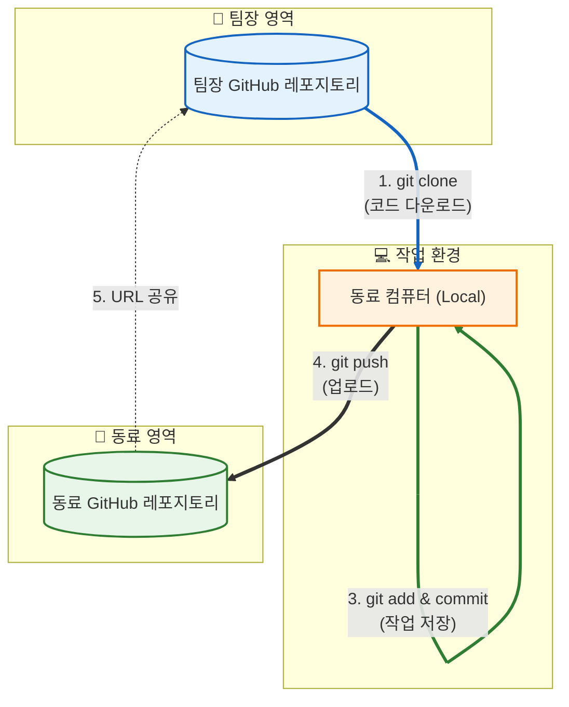

# 협업 가이드 (Collaboration Guide)

이 문서는 동료들이 프로젝트에 참여하여 코드를 수정하고 깃허브(GitHub)에 올리는 방법을 안내합니다. 
Git과 GitHub가 처음이어도 따라할 수 있도록 상세히 작성했습니다.

---

## 1. 사전 준비 (Preparation)

작업을 시작하기 전에 다음 프로그램들이 설치되어 있어야 합니다.

1.  **Git 설치**: [git-scm.com](https://git-scm.com/)에서 다운로드 후 설치
2.  **GitHub 가입**: [github.com](https://github.com/) 회원가입 및 로그인

---

## 2. 작업 흐름 (Workflow)

프론트엔드와 백엔드 모두 동일한 방식을 따릅니다.

### 1단계: 코드 가져오기 (Clone)
먼저 제 레포지토리(이 코드가 있는 곳)를 본인의 컴퓨터로 다운로드 받습니다.

1.  터미널(또는 Git Bash)을 엽니다.
2.  코드를 저장할 폴더로 이동합니다.
3.  아래 명령어를 입력합니다. (제 레포지토리 주소는 예시입니다)
    ```bash
    git clone <제_레포지토리_URL>
    ```

### 2단계: 내 레포지토리로 만들기 (Setup Own Repo)
다운로드 받은 코드를 **본인의 GitHub**에 새로 올리기 위한 작업입니다. 이렇게 해야 마음껏 수정하고 저장할 수 있습니다.

1.  **GitHub에서 새 레포지토리 만들기**:
    *   GitHub 로그인 -> 우측 상단 `+` 버튼 -> `New repository`
    *   Repository name 입력 (예: `my-energy-app-frontend`)
    *   `Create repository` 클릭
    *   생성된 레포지토리의 URL 복사 (예: `https://github.com/본인ID/my-energy-app-frontend.git`)

2.  **연결 정보 변경하기**:
    VS Code 터미널에서 다운로드 받은 폴더로 들어간 후, 아래 명령어들을 차례로 입력하세요.
    
    ```bash
    # 기존 원격 주소 삭제 (제 레포지토리와의 연결 끊기)
    git remote remove origin

    # 본인의 새 레포지토리 주소로 연결
    git remote add origin <복사한_본인_레포지토리_URL>

    # 첫 업로드 (본인 GitHub에 코드가 올라갑니다)
    git push -u origin main
    ```

### 3단계: 작업 및 수정 (Work)
이제 코드를 자유롭게 수정하세요. 기능 추가, 버그 수정 등 작업을 진행합니다.

### 4단계: 저장 및 업로드 (Commit & Push)>>이 과정은 코드를 수정할때마다 변경할때마다 하면 좋음
작업한 내용을 본인의 GitHub에 저장하는 과정입니다.

1.  **저장할 파일 선택 (Add)**:
    ```bash
    git add .
    ```
2.  **설명과 함께 저장 (Commit)**:
    ```bash
    git commit -m "작업한 내용 요약 (예: 로그인 화면 수정)"
    ```
3.  **GitHub에 업로드 (Push)**:
    ```bash
    git push origin main
    ```

### 5단계: 공유하기 (Share)
작업이 완료되면 본인의 GitHub 레포지토리 주소(URL)를 저에게 알려주세요. 제가 확인하고 통합하겠습니다.

---

## 3. 프로젝트 구조 및 파일 위치 (Project Structure)

어떤 파일을 수정해야 할지 모를 때 참고하세요.

### 📂 전체 구조
이 프로젝트는 **`energy-trading-app`** 폴더 안에 모든 코드가 들어있습니다.

```text
aws_pro1/
├── energy-trading-app/     # (중요) 실제 개발 코드가 있는 곳
│   ├── app/                # 페이지(화면) 파일들 (Next.js App Router)
│   ├── components/         # 재사용 가능한 UI 컴포넌트 (버튼, 헤더, 차트 등)
│   ├── public/             # 이미지, 폰트 등 정적 파일
│   ├── styles/             # CSS 스타일 파일
│   └── package.json        # 설치된 라이브러리 목록
├── docs/                   # 가이드 문서들
└── README.md               # 프로젝트 메인 설명
```

### 📍 주요 작업 위치
*   **새로운 페이지를 만들려면?**
    *   `energy-trading-app/app` 폴더 안에 새 폴더를 만들고 `page.tsx` 파일을 생성하세요.
*   **디자인(UI)을 수정하려면?**
    *   `energy-trading-app/components` 안에 있는 파일들을 확인하세요.
    *   예: 로그인 화면은 `components/login-screen.tsx`, 상단 메뉴는 `components/header.tsx` (예시)
*   **이미지를 넣으려면?**
    *   `energy-trading-app/public` 폴더에 이미지를 넣고 사용하세요.

---

## 4. Git이 너무 어렵다면? (AI 프롬프트 활용법)

명령어를 치는게 너무 복잡하고 어렵다면, AI(ChatGPT, Cursor, Copilot 등)에게 부탁해서 진행할 수도 있습니다.
아래처럼 AI에게 채팅으로 요청해보세요.

### 상황별 프롬프트 예시

**Q. 처음 시작할 때 (연결 변경)**
> "현재 폴더의 Git 원격 저장소 연결을 제 새로운 레포지토리 주소 `https://github.com/내아이디/내레포.git` 으로 바꾸고 싶어요. 기존 연결을 끊고 새로 연결해서 푸시하는 명령어를 실행해줘."

**Q. 작업 후 저장하고 싶을 때**
> "방금 수정한 코드들을 '로그인 버튼 디자인 변경'이라는 메시지로 커밋하고, 내 원격 저장소(origin)에 푸시해줘."


---

## 5. 전체 흐름도 (Workflow Diagram)
위에서 설명한 과정을 그림으로 표현하면 다음과 같습니다.



