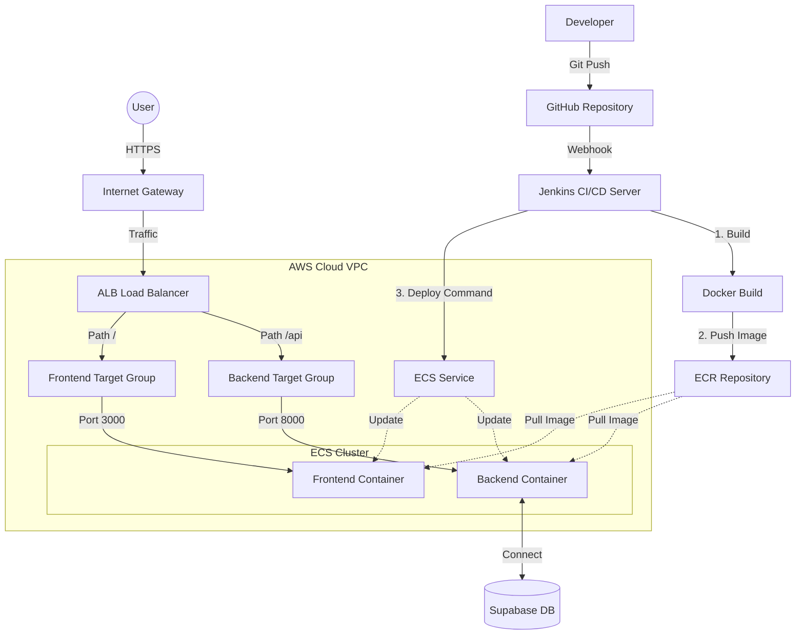

# 📘 Energy Truck 배포 마스터 가이드 (The Definitive Guide)

이 문서는 Energy Truck 프로젝트의 인프라 구축, 배포, 운영에 필요한 **모든 지식과 절차**를 담은 최종 가이드입니다. 이 문서 하나만 정독하면 프로젝트의 배포 환경을 완전히 이해하고 제어할 수 있습니다.

---

## 🏗 1. 핵심 개념 (Core Concepts)

우리가 사용하는 기술들이 **"왜"** 필요하고 **"무엇"**인지, 비전공자도 이해할 수 있는 비유로 설명합니다.

### 1️⃣ IaC (Infrastructure as Code) - Terraform
*   **개념:** 서버, 네트워크, 데이터베이스 같은 인프라를 마우스 클릭이 아니라 **코드**로 작성하여 관리하는 방식입니다.
*   **비유:** "건물 설계도"입니다.
    *   마우스 클릭으로 서버를 만드는 건, 현장에서 벽돌을 하나하나 쌓는 것과 같습니다. (시간이 오래 걸리고, 실수하기 쉽고, 똑같은 건물을 다시 짓기 어렵습니다.)
    *   **Terraform**은 설계도(코드)를 프린터(AWS)에 넣으면 건물이 자동으로 '뿅' 하고 생기는 것과 같습니다. 설계도만 있으면 똑같은 환경을 100번이고 다시 만들 수 있습니다.

### 2️⃣ Containerization - Docker
*   **개념:** 내 컴퓨터에서 돌아가는 프로그램이 다른 컴퓨터에서도 똑같이 돌아가도록, **실행 환경(OS, 라이브러리, 코드)**을 통째로 묶는 기술입니다.
*   **비유:** "밀키트(Meal Kit)"입니다.
    *   일반적인 배포는 레시피만 주는 것입니다. ("양파 사서 썰고, 소스 만들어서...") 받는 사람마다 맛이 달라질 수 있습니다. (= "내 컴퓨터에선 되는데 서버에선 안 돼요")
    *   **Docker**는 손질된 재료와 소스를 진공 포장해서 주는 밀키트입니다. 누가 요리하든 무조건 **똑같은 맛**이 납니다.

### 3️⃣ Serverless Compute - AWS Fargate
*   **개념:** 서버(EC2)를 직접 임대해서 관리(윈도우 업데이트, 보안 패치 등)할 필요 없이, 컨테이너만 던져주면 알아서 실행해 주는 서비스입니다.
*   **비유:** "호텔"입니다.
    *   **EC2 (일반 서버)**는 "월세방 계약"입니다. 청소, 수도 고장 수리, 보안 단속을 내가 다 해야 합니다.
    *   **Fargate**는 "호텔 투숙"입니다. 나는 짐(컨테이너)만 풀고 쉬면 됩니다. 청소나 관리는 호텔(AWS)이 다 해줍니다. 비싸 보이지만, 관리 인건비를 생각하면 훨씬 쌉니다.

### 4️⃣ CI/CD (Continuous Integration/Deployment) - Jenkins
*   **개념:** 코드 작성 후 배포까지의 과정을 자동화하는 것입니다.
*   **비유:** "자동화 공장 라인"입니다.
    *   개발자가 코드를 저장소(GitHub)에 올리면 -> 로봇(Jenkins)이 감지하고 -> 테스트하고 -> 포장(Build)해서 -> 배송(Deploy)까지 자동으로 수행합니다.

---

## 🏛 2. 아키텍처 상세 분석 (System Architecture)

본 프로젝트의 AWS 클라우드 인프라 구성도입니다. 외부 사용자의 트래픽이 Internet Gateway와 Load Balancer를 거쳐, 요청 경로(/api 또는 /)에 따라 적절한 컨테이너 서비스로 라우팅되는 전체 흐름을 나타냅니다. Jenkins CI/CD 파이프라인을 통한 자동 배포 흐름도 포함되어 있습니다.



### 구성 요소별 역할

#### 📡 네트워크 계층
1.  **VPC (Virtual Private Cloud):** AWS 안에 만드는 우리만의 **비공개 가상 데이터 센터**입니다. 외부와 격리되어 보안을 유지합니다.
    *   `vpc.tf`에서 CIDR 블록 `10.0.0.0/16`으로 정의
    *   2개의 Public Subnet (AZ-a, AZ-c)으로 고가용성 구성

2.  **IGW (Internet Gateway):** VPC가 인터넷과 통신할 수 있게 해주는 **대문**입니다.
    *   `vpc.tf`에서 생성되며, Route Table과 연결되어 외부 트래픽 허용

3.  **ALB (Application Load Balancer):** 트래픽을 분산시키는 **교통 경찰**입니다.
    *   `alb.tf`에서 정의
    *   **라우팅 규칙:**
        *   `/api/*` 경로 → Backend Target Group (Port 8000)
        *   그 외 모든 경로 → Frontend Target Group (Port 3000)
    *   Health Check를 통해 정상 컨테이너에만 트래픽 전송

4.  **Target Group:** ALB가 트래픽을 전달할 **목적지 그룹**입니다.
    *   Frontend TG: `/` 경로용 (Health Check: `/`)
    *   Backend TG: `/api/*` 경로용 (Health Check: `/health`)

#### 🐳 컨테이너 실행 계층
5.  **ECR (Elastic Container Registry):** Docker 이미지를 저장하는 **AWS 전용 물류 창고**입니다.
    *   `ecr.tf`에서 생성
    *   보안 스캔 기능 활성화 (`scan_on_push = true`)
    *   Jenkins가 빌드한 이미지를 여기에 푸시

6.  **ECS Cluster:** 여러 컨테이너들이 실행되는 **울타리(논리적 그룹)**입니다.
    *   `ecs.tf`에서 `energy-truck-cluster` 생성
    *   Fargate 타입으로 서버리스 운영

7.  **Task Definition:** 컨테이너 실행 **설계도**입니다.
    *   CPU: 256 (.25 vCPU), Memory: 512 MB
    *   **환경변수 주입:** `DATABASE_URL`, `SUPABASE_URL`, `SUPABASE_KEY` 등
    *   네트워크 모드: `awsvpc` (각 Task가 독립적인 ENI 할당)

8.  **ECS Service:** Task를 **항상 살아있게** 관리하는 관리자입니다.
    *   `desired_count = 1`: 항상 1개의 Task 유지
    *   컨테이너가 죽으면 자동으로 재시작
    *   ALB와 연동되어 트래픽 수신

#### 🤖 CI/CD 자동화 계층
9.  **Jenkins CI/CD Server:** 배포 자동화 로봇입니다.
    *   **역할:** Developer의 Git Push를 감지하고 자동으로 빌드/배포 수행
    *   **Jenkinsfile 파이프라인 단계:**
        1. `Checkout`: GitHub에서 최신 코드 다운로드
        2. `Build`: Docker 이미지 빌드 (`docker build`)
        3. `Login`: AWS ECR 인증
        4. `Push`: 빌드된 이미지를 ECR에 업로드
        5. `Deploy`: `aws ecs update-service --force-new-deployment` 실행으로 ECS가 새 이미지 사용하도록 강제
    *   **환경변수 관리:** `AWS_ACCOUNT_ID`, `IMAGE_TAG` 등을 정의

10. **GitHub Repository:** 소스 코드 저장소입니다.
    *   Webhook 설정을 통해 코드 Push 시 Jenkins 트리거

#### 🗄️ 외부 서비스
11. **Supabase Database:** 외부 PostgreSQL 데이터베이스입니다.
    *   Backend 컨테이너가 환경변수(`SUPABASE_URL`)를 통해 연결
    *   AWS 외부에 있지만 인터넷을 통해 접근 가능

---

## 📂 3. 배포 코드 완전 해부 (Deployment Code Deep Dive)

프로젝트 내 배포 관련 파일들을 **코드 레벨**에서 상세히 분석합니다.

### 3.1 Terraform 인프라 코드

#### 📄 `terraform/provider.tf` - AWS 연결 설정
```hcl
terraform {
  required_providers {
    aws = {
      source  = "hashicorp/aws"
      version = "~> 5.0"  # AWS Provider 버전 지정
    }
  }
}

provider "aws" {
  region = var.aws_region  # variables.tf에서 정의한 리전 사용
}
```
**역할:** Terraform이 AWS와 통신하기 위한 설정. 리전과 Provider 버전을 명시합니다.

---

#### 📄 `terraform/vpc.tf` - 네트워크 구성
```hcl
resource "aws_vpc" "main" {
  cidr_block           = var.vpc_cidr          # 10.0.0.0/16
  enable_dns_hostnames = true                   # ECS Task가 DNS 이름 사용 가능
  enable_dns_support   = true
}

resource "aws_subnet" "public_a" {
  vpc_id                  = aws_vpc.main.id
  cidr_block              = "10.0.1.0/24"       # 256개 IP 할당 가능
  availability_zone       = "${var.aws_region}a" # ap-northeast-2a
  map_public_ip_on_launch = true                # Public IP 자동 할당
}
```
**역할:** VPC(사설 네트워크), 서브넷(IP 대역), IGW(인터넷 연결) 생성. **2개의 AZ**에 서브넷을 배치하여 고가용성 확보.

---

#### 📄 `terraform/alb.tf` - 트래픽 라우팅
```hcl
resource "aws_lb_listener_rule" "backend" {
  listener_arn = aws_lb_listener.http.arn
  priority     = 100

  action {
    type             = "forward"
    target_group_arn = aws_lb_target_group.backend.arn
  }

  condition {
    path_pattern {
      values = ["/api/*"]  # /api로 시작하는 모든 요청을 백엔드로
    }
  }
}
```
**역할:** HTTP 포트 80으로 들어온 요청을 경로(`/api/*`)에 따라 Frontend 또는 Backend로 분배.

---

#### 📄 `terraform/ecr.tf` - 이미지 저장소
```hcl
resource "aws_ecr_repository" "backend" {
  name                 = "${var.project_name}-backend"  # energy-truck-backend
  image_tag_mutability = "MUTABLE"                      # 태그 덮어쓰기 허용
  
  image_scanning_configuration {
    scan_on_push = true  # 보안 취약점 자동 스캔
  }
}
```
**역할:** Docker 이미지를 저장할 ECR Repository 생성. Jenkins가 여기에 이미지를 푸시합니다.

---

#### 📄 `terraform/ecs.tf` - 컨테이너 실행 정의 ⭐ (가장 중요)
```hcl
resource "aws_ecs_task_definition" "backend" {
  family                   = "${var.project_name}-backend-task"
  network_mode             = "awsvpc"           # Task가 독립 네트워크 인터페이스 소유
  requires_compatibilities = ["FARGATE"]         # 서버리스 모드
  cpu                      = 256                 # 0.25 vCPU
  memory                   = 512                 # 512 MB
  execution_role_arn       = aws_iam_role.ecs_task_execution_role.arn

  container_definitions = jsonencode([
    {
      name  = "backend"
      image = "${aws_ecr_repository.backend.repository_url}:latest"
      
      # 🔥 환경변수 주입 (DB 연결 정보 등)
      environment = [
        { name = "DATABASE_URL", value = "postgres://..." },
        { name = "SUPABASE_URL", value = "your_supabase_url" },
        { name = "SUPABASE_KEY", value = "your_supabase_key" }
      ]
      
      portMappings = [
        { containerPort = 8000, hostPort = 8000 }
      ]
    }
  ])
}

resource "aws_ecs_service" "backend" {
  name            = "${var.project_name}-backend-service"
  cluster         = aws_ecs_cluster.main.id
  task_definition = aws_ecs_task_definition.backend.arn
  desired_count   = 1  # 항상 1개 Task 유지
  launch_type     = "FARGATE"
  
  network_configuration {
    subnets          = [aws_subnet.public_a.id, aws_subnet.public_c.id]
    security_groups  = [aws_security_group.ecs_tasks.id]
    assign_public_ip = true  # Public IP 할당 (외부 통신 가능)
  }
  
  load_balancer {
    target_group_arn = aws_lb_target_group.backend.arn
    container_name   = "backend"
    container_port   = 8000
  }
}
```
**역할:** Task Definition(컨테이너 스펙)과 Service(운영 정책)를 정의. **환경변수를 여기서 주입합니다!**

---

#### 📄 `terraform/iam.tf` - 권한 관리
```hcl
resource "aws_iam_role" "ecs_task_execution_role" {
  name = "${var.project_name}-ecs-task-execution-role"
  
  assume_role_policy = jsonencode({
    Statement = [{
      Action = "sts:AssumeRole"
      Principal = { Service = "ecs-tasks.amazonaws.com" }
    }]
  })
}

resource "aws_iam_role_policy_attachment" "ecs_task_execution_role_policy" {
  role       = aws_iam_role.ecs_task_execution_role.name
  policy_arn = "arn:aws:iam::aws:policy/service-role/AmazonECSTaskExecutionRolePolicy"
}
```
**역할:** ECS가 ECR에서 이미지를 Pull하고, CloudWatch에 로그를 쓸 수 있도록 권한 부여.

---

### 3.2 CI/CD 자동화 코드

#### 📄 `Jenkinsfile` - 배포 자동화 파이프라인
```groovy
pipeline {
    agent any
    
    environment {
        AWS_ACCOUNT_ID = 'your-aws-account-id'
        AWS_REGION = 'ap-northeast-2'
        ECR_REPO_BACKEND = 'energy-truck-backend'
        IMAGE_TAG = "build-${BUILD_NUMBER}"  # 빌드 번호로 태그 관리
    }
    
    stages {
        stage('Checkout') {
            steps {
                checkout scm  # GitHub에서 최신 코드 가져오기
            }
        }
        
        stage('Build Backend') {
            steps {
                script {
                    docker.build("${ECR_REPO_BACKEND}:${IMAGE_TAG}", "-f backend/Dockerfile backend")
                }
            }
        }
        
        stage('Login to ECR') {
            steps {
                sh "aws ecr get-login-password --region ${AWS_REGION} | docker login --username AWS --password-stdin ${AWS_ACCOUNT_ID}.dkr.ecr.${AWS_REGION}.amazonaws.com"
            }
        }
        
        stage('Push Images') {
            steps {
                sh "docker tag ${ECR_REPO_BACKEND}:${IMAGE_TAG} ${AWS_ACCOUNT_ID}.dkr.ecr.${AWS_REGION}.amazonaws.com/${ECR_REPO_BACKEND}:${IMAGE_TAG}"
                sh "docker push ${AWS_ACCOUNT_ID}.dkr.ecr.${AWS_REGION}.amazonaws.com/${ECR_REPO_BACKEND}:${IMAGE_TAG}"
            }
        }
        
        stage('Deploy to ECS') {
            steps {
                sh "aws ecs update-service --cluster energy-truck-cluster --service energy-truck-backend-service --force-new-deployment --region ${AWS_REGION}"
            }
        }
    }
}
```
**역할:** 코드 변경 → 빌드 → 푸시 → 배포까지 완전 자동화. `--force-new-deployment`로 ECS가 새 이미지 사용하도록 강제.

---


### 3.3 로컬 development 환경 도구 (Docker + WSL 기반)

#### 📄 `docker-compose.yml` - Terraform 실행 환경
```yaml
services:
  terraform:
    image: hashicorp/terraform:latest
    working_dir: /workspace
    volumes:
      - ./terraform:/workspace  # 로컬 terraform 폴더를 컨테이너에 마운트
    env_file:
      - ./backend/.env          # AWS 자격 증명 및 환경변수 로드
```
**역할:** 로컬 PC에 Terraform이나 AWS CLI 설치 없이, Docker 컨테이너로 인프라 관리. **WSL 2 터미널**에서 실행을 권장합니다 (Windows 파일 잠금 문제 회피).

#### 📄 `backend/.env` - 통합 환경변수 관리
```env
# Supabase 연결 정보
SUPABASE_URL=https://...
SUPABASE_KEY=sb_publishable_...

# AWS 자격 증명 (Terraform용)
AWS_ACCESS_KEY_ID=AKIA...
AWS_SECRET_ACCESS_KEY=...
AWS_DEFAULT_REGION=ap-northeast-2
```
**역할:** Terraform 실행 시 AWS 인증 정보를 Docker 컨테이너로 주입. `.gitignore`에 등록되어 있어 보안 유지.

#### 📄 `terraform/terraform.tfvars.example` - 변수 템플릿
```hcl
aws_region = "ap-northeast-2"
project_name = "energy-truck"
vpc_cidr = "10.0.0.0/16"
```
**역할:** Terraform 변수 값 템플릿. 복사하여 `terraform.tfvars`로 사용 가능 (선택 사항, 기본값 사용 가능).


---

## 🛠 4. 배포 실행 가이드 (Step-by-Step Execution)

이제 이론은 충분합니다. 실제로 배포를 진행하는 절차입니다.
**이 순서를 반드시 지켜야 에러가 안 납니다.**

### [STEP 0] 사전 준비 (Pre-requisites)

> 💡 **권장 실행 환경**: WSL 2 (Ubuntu) 터미널에서 실행하세요. Windows PowerShell은 파일 잠금 문제가 있을 수 있습니다.

1.  **Docker Desktop 확인:**
    - Docker Desktop이 실행 중이어야 합니다.
    - Settings → Resources → WSL Integration에서 사용 중인 배포판(Ubuntu 등) 활성화 확인.

2.  **환경변수 설정 (`backend/.env`):**
    ```env
    AWS_ACCESS_KEY_ID=AKIA...
    AWS_SECRET_ACCESS_KEY=...
    AWS_DEFAULT_REGION=ap-northeast-2
    ```
    상세 가이드: [`docs/terraform-env-setup.md`](./terraform-env-setup.md)

3.  **프로젝트 경로 이동 (WSL):**
    ```bash
    cd /mnt/c/workspace2/aws_pro1
    ```

4.  **Task Definition 환경변수 수정:**
    `terraform/ecs.tf` 파일의 `environment` 블록에서 Supabase URL/KEY를 실제 값으로 수정했는지 확인하세요.

### [STEP 0.5] 환경 변수 상세 설정 🔐

> 📖 **참고 문서**: [`docs/terraform-env-setup.md`](./terraform-env-setup.md)에 더 자세한 설명이 있습니다.

#### AWS 자격 증명 추가

`backend/.env` 파일을 열어 다음 내용을 추가하세요:

```env
# Supabase (기존)
SUPABASE_URL=https://loohzspmcmafmxachwpg.supabase.co
SUPABASE_KEY=sb_publishable_...

# AWS Credentials (Terraform용 - 추가)
AWS_ACCESS_KEY_ID=AKIA...
AWS_SECRET_ACCESS_KEY=...
AWS_DEFAULT_REGION=ap-northeast-2
```

#### Terraform 변수 파일 생성 (선택)

기본값을 변경하고 싶다면:

```bash
cd terraform
cp terraform.tfvars.example terraform.tfvars
# terraform.tfvars 파일 편집
```

#### 보안 확인

```bash
# .gitignore에 다음이 포함되어 있는지 확인
cat .gitignore | grep -E '\.env|tfvars'
# 출력: .env, *.tfvars 등이 있어야 함
```

### [STEP 1] ECR(이미지 저장소) 먼저 생성
ECS(서버)를 띄우려면 Docker 이미지가 있어야 하고, 이미지를 올리려면 저장소(ECR)가 먼저 있어야 합니다. 그러니 **ECR만 먼저 만듭니다.**

```bash
# ECR 리소스만 타겟팅해서 먼저 생성
docker-compose run --rm terraform apply -target=aws_ecr_repository.frontend -target=aws_ecr_repository.backend
```
*   `Outputs`에 ECR 리포지토리 주소가 나올 겁니다. (예: `12345.dkr.ecr...`)

### [STEP 2] Docker 이미지 빌드 및 푸시 (Build & Push)
방금 만든 저장소에 우리 코드를 포장해서 올립니다. 이 작업은 Jenkins가 없으므로 **로컬에서 수동**으로 합니다.

```bash
# 1. AWS ECR 로그인 (Docker에게 권한 주기)
aws ecr get-login-password --region ap-northeast-2 | docker login --username AWS --password-stdin [ACCOUNT_ID].dkr.ecr.ap-northeast-2.amazonaws.com

# 2. 백엔드 빌드 & 푸시
docker build -t energy-truck-backend ./backend
docker tag energy-truck-backend:latest [ACCOUNT_ID].dkr.ecr.ap-northeast-2.amazonaws.com/energy-truck-backend:latest
docker push [ACCOUNT_ID].dkr.ecr.ap-northeast-2.amazonaws.com/energy-truck-backend:latest

# 3. 프론트엔드 빌드 & 푸시
docker build -t energy-truck-frontend ./energy-trading-app
docker tag energy-truck-frontend:latest [ACCOUNT_ID].dkr.ecr.ap-northeast-2.amazonaws.com/energy-truck-frontend:latest
docker push [ACCOUNT_ID].dkr.ecr.ap-northeast-2.amazonaws.com/energy-truck-frontend:latest
```

### [STEP 3] 전체 인프라 생성 (Final Apply)
이제 이미지가 준비되었으니, 나머지 서버(ECS), 로드밸런서(ALB), 네트워크(VPC)를 한꺼번에 만듭니다.

```bash
# 전체 적용
docker-compose run --rm terraform apply
```
*   완료되면 `alb_dns_name` 같은 주소가 출력됩니다. 그 주소로 접속하면 사이트가 뜹니다!

---

## 🤖 5. Jenkins 자동화 (Future Work)

우리가 수동으로 했던 [STEP 2] 과정을 자동화하는 것입니다.

**Jenkins 파이프라인 흐름:**
1.  **Stage 'Checkout'**: 개발자가 GitHub에 `push`하면 Jenkins가 코드를 가져감.
2.  **Stage 'Build'**: `docker build` 실행.
3.  **Stage 'Push'**: `docker push`로 ECR에 업로드.
4.  **Stage 'Deploy'**: `aws ecs update-service --force-new-deployment` 명령어로 ECS가 새 이미지를 쓰도록 강제 업데이트.

---

## 💰 6. 과금 방지 및 비용 관리 (Cost Management)

방심하면 돈이 나갑니다. 꼭 확인하세요.

| 리소스 | 과금 기준 | 절약 방법 |
|:---|:---|:---|
| **ALB** | 시간당 $0.0225 (약 2~3만원/월) | 안 쓸 땐 `terraform destroy`로 삭제 |
| **Fargate** | vCPU/Memory 사용 시간 | `ecs.tf`에서 `desired_count = 0`으로 두면 비용 0원 |
| **ECR** | 저장 용량 (GB당 $0.1) | 옛날 이미지 주기적으로 삭제 (Lifecycle Policy) |
| **NAT Gateway** | 시간당 $0.045 (약 5만원/월) | **현재 아키텍처에는 없음 (Public Subnet 사용으로 비용 절감)** |

---

## ❓ 7. 문제 해결 (Troubleshooting)

**Q. `terraform apply` 중 데드락(멈춤)이 걸려요.**
A. ECS 서비스가 이미지를 못 찾아서 계속 재시도 중일 수 있습니다. **[STEP 1] -> [STEP 2]** 순서를 지켰는지 확인하세요.

**Q. 배포했는데 사이트가 안 떠요 (503 Error).**
A. 컨테이너가 실행되자마자 죽었을 확률이 높습니다.
    1. AWS 콘솔 -> ECS -> Cluster -> Task -> Logs 탭 확인.
    2. 보통 **DB 연결 실패(환경변수 오류)**가 원인입니다. `ecs.tf`의 `environment` 값을 다시 확인하세요.

---

이 문서는 프로젝트의 **지도**입니다. 길을 잃을 때마다 다시 돌아와서 확인하세요. 🚀
